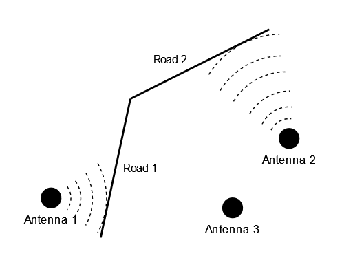

.. include:: ../include/code.rst
.. include:: ../include/glossary.rst

.. _custom-model:

Developing a custom Model
==========================

Before creating a new model, you should first be sure it is not possible to use (a combination)
of other models that match the functionality that you need. For example, the 
|code_UDFModel| can provide many a simple calculation. If the output data is known beforehand
it might be sufficient to construct the data beforehand and use a |code_TapePlayer| or 
|code_CSVPlayer| Model

In this section we will guide you through the process of creating a custom model. During this
tutorial you will build a simple model to estimate the telecom signal strength on roads based on
the proximity of telecom antennas in the area. This model could then for example be used in
scenario's that deal with investments in either the telecom network or the roads network. 
Furthermore it could be augmented to include effects like weather.

The tutorial will cover many common aspects of developing a new Model: How to deal with input data,
how to implement a Model's business logic, how to use the tools that Movici 
provides to aid you in developing a Model and how to test a Model.

Overview
---------

Let's first look at the Model from a domain perspective: what is it that the 
Model should do? The goal of the model is to provide information about the
cellular network coverage of roads in a road network. Let's look at a diagram of 
such a situation:

.. _custom-model-schematic:

  
  Road cellular coverage schematic

From the schematic we can infer the following assumptions/simplifications:

* There are N roads segments and M telecom antenna towers
* Every road segment is serviced by a single, closest, telecom antenna tower (*simplification*)
* Signal strength is lower when the closest telecom antenna is further away from a road
* Signal strength is not dependent on the amount of connected devices (*simplification*)
* All roads are serviced by an antenna, although the signal strength may be very low
* Some antennas may not be closest to any road, and do therefore not service any road

Calculation steps
^^^^^^^^^^^^^^^^^^

We can define the following steps that need to be taken by the (algorithm):

#. Read all roads and antennas
#. For every road:

   #. Find the closest antenna and its distance
   #. Based on the distance to the nearest antenna, calculate the signal strength at the road

#. Output signal strength on the roads

Signal strength formula
^^^^^^^^^^^^^^^^^^^^^^^^

For our Model, we'll considered a very simple formula for calculating signal strength. It does
not take into account the type of signal (3G, 4G, 5G) or the shape/directionality of the telecom 
antenna. Signal strength is measured in decibel (dB). For a cellular network, signal strength lies
somewhere between ``-30 dB(m)`` at the base of the antenna tower, down to ``-110 dB(m)`` towards
the end of the antenna's coverage. Any signal below ``-110 dB(mn)`` can be considered too low to
be usable. [#]_

The decrease in signal strength can be caculated using the inverse square law and the fact that
``dB`` uses a logarithmic scale: [#]_

.. math::
  
  L_{dist} = L_{ref} - 20 \cdot \log \left( \frac{r_{dist}}{r_{ref}} \right)

with:

| :math:`L_{ref}`: Reference signal strength
| :math:`r_{ref}`: Distance from the antenna (radius) of the reference signal strength :math:`L_{ref}`
| :math:`r_{dist}`: Distance from the antenna (radius) to calculate the signal strength
| :math:`L_{dist}`: Signal strength at distance :math:`r_{dist}`

.. [#] https://www.signalbooster.com/blogs/news/how-to-measure-signal-strength-in-decibels-on-your-cell-phone
.. [#] https://www.engineeringtoolbox.com/inverse-square-law-d_890.html

In our model, we'll define the reference radius at 1m. For the reference signal strength we'll take
a representative value of ``-30 dB``. However, since this value will be set as an attribute in the
antennas dataset, it is easy to change to a more accurate value, and/or a value per telecom
antenna.

With this information in hand we can go to the next step: data modelling.

Data model
-----------

We need to define what our input and output data look like. In code, we define what entity groups
and what attributes the model subscribes to, and what entity groups and atttributes it publishes
to. We start by importing or defining all the attributes that we'll be working with

.. testcode:: m1

  from movici_simulation_core import AttributeSpec
  from movici_simulation_core.attributes import (
      Geometry_X,
      Geometry_Y,
      Geometry_Linestring2d
  )

  SignalStrength = AttributeSpec("antennas.signal_strength", float)

We'll use the predefined attributes for point geometries (``Geometry_X`` and ``Geometry_Y``) and
we define a new attribute ``SignalStrength``, having the json-name ``"antennas.signal_strength"``.
It is going to contain a single `float` per entity. We expect the input data to contain this 
attribute, with the same type. We can now define our data model as two classes, one for the 
antenna towers, and one for the road segments. Let's start with the antennas:

.. testcode:: m1

  from movici_simulation_core import EntityGroup, field, INIT, SUB
  
  class AntennaEntities(EntityGroup, name="antenna_entities"):
      x = field(Geometry_X, flags=INIT)
      y = field(Geometry_Y, flags=INIT)
      signal_strength = field(SignalStrength, flags=SUB)

We define a class ``AntennaEntities`` that is linked to the entity type ``"antenna_entities"``. It
has three fields ``x``, ``y`` and ``signal_strength``. We use the ``field`` function to tie an 
attribute to an ``EntityGroup`` class field. Per attribute, we also need to indicate its purpose.
In this case all three attributes are either ``INIT`` or ``SUB``. Both ``INIT`` and ``SUB`` means
that the model subscribes to these attributes. The difference comes from when the attributes are
expected to be available in the lifecycle of the Model: ``INIT`` attributes are required for the
Model's initialization phase, while ``SUB`` attributes are required in the update phase (see also:
:ref:`simulation-life-cycle`). Using this class we will be able to access the antenna's coordinates
by the ``AntennaEntities.x`` and ``AntennaEntities.y`` fields. The signal strength will be 
available under ``AntennaEntities.signal_strength``.

Next we define the road segments:

.. testcode:: m1

  from movici_simulation_core import PUB

  class RoadSegmentEntities(EntityGroup, name="road_segment_entities"):
      geometry = field(Geometry_Linestring2d, flags=INIT)
      signal_strength = field(SignalStrength, flags=PUB)

We tie our ``RoadSegmentEntities`` class to the ``road_segment_entities`` entity type and we define
two fields: ``geometry`` will hold the road linestring geometry, which we need during 
initialization and we reuse the ``SignalStrength`` attribute. We will use this attribute on the
road segments as our Model's output, which we therefore give a ``PUB`` flag to indicate our intend
to publish this attribute.

Our full data model looks like this:

.. testcode:: m1

  from movici_simulation_core import AttributeSpec
  from movici_simulation_core.attributes import (
      Geometry_X,
      Geometry_Y,
      Geometry_Linestring2d
  )
  from movici_simulation_core import EntityGroup, field, INIT, PUB, SUB

  SignalStrength = AttributeSpec("antennas.signal_strength", float)

  
  class AntennaEntities(EntityGroup, name="antenna_entities"):
      x = field(Geometry_X, flags=INIT)
      y = field(Geometry_Y, flags=INIT)
      signal_strength = field(SignalStrength, flags=SUB)

  class RoadSegmentEntities(EntityGroup, name="road_segment_entities"):
      geometry = field(Geometry_Linestring2d, flags=INIT)
      signal_strength = field(SignalStrength, flags=PUB)

Note that we have not defined the exact dataset names of the antennas and the road segments. We
want to be able to reuse the Model in different |Scenarios| and we should not restrict our model to
a specific dataset. We will provide the dataset names when we configure the scenario in the model's 
config.

Calculation Model
-------------------

Next we'll create the Calculation Model, or just Model. For this we use the |code_TrackedModel| as
the Model's base class. ``TrackedModel`` provides your model with an instance of 
|code_TrackedState| to store the model's world state and deal with |Updates| automatically so
that we can focus on the business logic of the model. For most models, this is the recommended base
class to use.

To use ``TrackedModel`` we implement three methods of its lifecycle: ``setup``, ``initialize`` and
``update``. ``setup`` is called once before any world data is available. The model can use this
method to register any ``EntityGroup``\s for its |Datamask| so that it subscribes to the right 
data. ``initialize`` will be called whenever the model's ``INIT`` data is available. This data may
come from an initial |Dataset| or it may be output from another model. After ``initialize``, 
``update`` will be called at least once at ``t=0`` and subsequently only when there is new data
available to the model, or when the Model's ``next_time`` has been reached in the simulation. Our
model is a :ref:`Steady State Model<movici-overview-kinds-of-models>` so it will only be called
whenever it's subscribed data has changed. Let's first look at the structure of our Model class:

.. testcode:: m1

  from movici_simulation_core import TrackedModel, TrackedState
  
  class SignalStrengthModel(TrackedModel, name="signal_strength"):
      def setup(self, state: TrackedState, **_):
          ...
        
      def initialize(self, **_):
          ...

      def update(self, **_):
          ...

We can see that ``SignalStrengthModel`` derives from ``TrackedModel`` and that we have provided
the signatures for the three methods we need to implement. When these methods are called, they
are called with a number of keyword arguments (see |code_TrackedModel|). Apart from the ``state``
argument in ``setup``, we don't need any, so we'll hide those parameters using the ``**_``
catch-all. We've also given our class a ``name`` (ie. ``signal_strength``) that can be used to
refer to the Model when creating a |Scenario| config.

Next, we'll look at the implementation of the three methods, starting with ``setup``

.. testcode:: m1

  from movici_simulation_core import TrackedModel, TrackedState
  
  class SignalStrengthModel(TrackedModel, name="signal_strength"):
      def setup(self, state: TrackedState, **_):
          # We only have the model config available. The goal is to setup the state properly
          # with our pub/sub datamask
          antennas_ds = self.config["antennas"]
          roads_ds = self.config["roads"]

          self.antennas = state.register_entity_group(antennas_ds, AntennaEntities)
          self.roads = state.register_entity_group(roads_ds, RoadSegmentEntities)
        
      def initialize(self, **_):
          ...

      def update(self, **_):
          ...

With the ``setup`` call, we'll receive a ``TrackedState`` object that we need to configure with
the attributes we subscribe and publish to. We'll define that from our Model's config in the 
Scenario we expect a ``"antennas"`` and a ``"roads"`` key, with the relevant dataset names in the
Scenario. We can then use these dataset name to register the respective entity groups from the 
data model using ``TrackedState.register_entity_group``. This method takes in a dataset name and
either a ``EntityGroup`` type (class) or an instance thereof. In our case we give it the type. The
method returns an instance of that type that is bound to the ``state`` object: whenever we interact
with these instances, the underlying data resided in the ``state`` object and changes are tracked,
so that the ``TrackedModel`` knows what Updates to send back to the simulation whenever the model's
``update`` method returns (hence the name ``TrackedState`` and ``TrackedModel``.

Now we'll continue with the ``initialize`` method:

.. testcode:: m1

  from movici_geo_query.geo_query import GeoQuery
  from movici_geo_query.geometry import LinestringGeometry, PointGeometry
  
  class SignalStrengthModel(TrackedModel, name="signal_strength"):
      def setup(self, state: TrackedState, **_):
          ... # omitted
        
      def initialize(self, **_):
          # all ``INIT`` attributes are available, we can use them to link every road segment to
          # its nearest antenna tower
          antennas_as_geometry = self.antennas.get_geometry()
          roads_as_geometry = self.roads.get_geometry()
          gq = GeoQuery(antennas_as_geometry)
          result = gq.nearest_to(roads_as_geometry)
  
          # self.nearest_antennas contains the index of the nearest antenna (in the self.antennas
          # entity group) for every road
          self.nearest_antennas = result.indices
  
          # self.distances contains the distance to the nearest antenna for every road
          # the reference signal strength is at a distance of 1 m. If the mapping results in a
          # distance <1m it would result wrong results, or even raise ZeroDivisionError. We set the
          # minimum distance to one meter
          self.distances = np.maximum(result.distances, 1)

  class AntennaEntities(EntityGroup, name="antenna_entities"):
      x = field(Geometry_X, flags=INIT)
      y = field(Geometry_Y, flags=INIT)
      signal_strength = field(SignalStrength, flags=SUB)

      def get_geometry(self) -> PointGeometry:
          return PointGeometry(points=np.stack((self.x.array, self.y.array), axis=-1))

  class RoadSegmentEntities(EntityGroup, name="road_segment_entities"):
      geometry = field(Geometry_Linestring2d, flags=INIT)
      signal_strength = field(SignalStrength, flags=PUB)

      def get_geometry(self) -> LinestringGeometry:
          return LinestringGeometry(points=self.geometry.csr.data, row_ptr=self.geometry.csr.row_ptr)

During the ``initialize`` call, we have all geometric information of the antennas and road 
segments available (since we've defined them in our data model as ``INIT``). We use the geometries 
to find the closest antenna tower (and its distance) for every road segment. For this we use the
spatial indexing / querying tool ``movici_geo_query``. This Movici library can perform spatial 
queries between entity groups similar to other spatial indexing tools such as ``rtree`` or 
``PyGEOS`` (used by ``geopandas``), but it is optimized to work with the (vectorized) movici data
format. ``movici_geo_query`` accepts ``Geometry`` objects such as ``PointGeometry`` and 
``LinestringGeometry`` which each hold an array of these geometry types. For this we add 
``get_geometry`` helper methods to our data model classes. See :ref:`models-geospatial-queries` for
more information. We perform the mapping by creating a ``GeoQuery`` object with the antennas'
``PointGeometry`` which creates the spatial index. We then query that index to get the nearest
antenna for every road segment in the roads' ``LinestringGeometry``. The query returns the closest
antenna per road (as an index(position) in the antennas enity group), and the distance to the
closest antenna. We store this info in the Model object to be used later on (in the ``update``)
method.

.. note::
  
  The model assumes that the geometry of all entities does not change during the simulation. This
  is an assumption that many Models make. For many scenarios, the geometry does not change over
  time, so this is not an issue. It is technically possible to create and use Models that do allow
  geometries to change. However, this leads to incompatibilities further downstream the toolchain
  as for example the Movici visualisation tools do not (yet) support changing geometries

The last method we need to implement is ``update``. This method will be called at ``t=0`` and 
every time there is a change in the subscribed data. Let look at the code:

.. testcode:: m1

   class SignalStrengthModel(TrackedModel, name="signal_strength"):
      def setup(self, state: TrackedState, **_):
          ... # omitted
        
      def initialize(self, **_):
          ... # omitted

      def update(self, **_):
          # update will only be called once initialized has returned succesfully. We can be sure
          # that self.nearest_antennas and self.distances are set

          l_ref = self.antennas.signal_strength[self.nearest_antennas]

          # In the signal strength formula we need to divide by r_ref inside the logarithm. Here
          # r_ref == 1 so we don't strictly need to include it. However for completeness sake we
          # still divide by 1
          self.roads.signal_strength[:] = l_ref - 20 * np.log10(self.distances / 1)

We start by retrieving the reference signal strength for each nearest antenna. Using the fact that
every attribute is (under the hood) as `numpy.ndarray` we simply calculate the signal strength for
every road segment in a vectorized way. We assign the calculated roads signal strength using the
`[:]` notation to update the values inside the array, this way the ``TrackedState`` can properly
detect all changes. If now, in a later stage the reference signal strength would drop
for some of the antennas, we can still calculate for every antenna, and the ``TrackedState`` would
filter out any values that haven't changed, and still produce an Update that consists only of the
changed data.

Final example code
--------------------

.. testcode:: m2

  import numpy as np
  from movici_geo_query.geo_query import GeoQuery
  from movici_geo_query.geometry import LinestringGeometry, PointGeometry
  
  from movici_simulation_core import (
      INIT,
      PUB,
      SUB,
      AttributeSchema,
      AttributeSpec,
      EntityGroup,
      TrackedModel,
      TrackedState,
      field,
  )
  from movici_simulation_core.attributes import (
      Geometry_Linestring2d,
      Geometry_X,
      Geometry_Y,
  )

  SignalStrength = AttributeSpec("antennas.signal_strength", float)

  class AntennaEntities(EntityGroup, name="antenna_entities"):
      x = field(Geometry_X, flags=INIT)
      y = field(Geometry_Y, flags=INIT)
      signal_strength = field(SignalStrength, flags=SUB)

      def get_geometry(self) -> PointGeometry:
          return PointGeometry(points=np.stack((self.x.array, self.y.array), axis=-1))

  class RoadSegmentEntities(EntityGroup, name="road_segment_entities"):
      geometry = field(Geometry_Linestring2d, flags=INIT)
      signal_strength = field(SignalStrength, flags=PUB)

      def get_geometry(self) -> LinestringGeometry:
          return LinestringGeometry(points=self.geometry.csr.data, row_ptr=self.geometry.csr.row_ptr)

  class SignalStrengthModel(TrackedModel, name="signal_strength"):
      antennas: AntennaEntities
      roads: RoadSegmentEntities
      nearest_antennas: np.ndarray
      distances: np.ndarray

      def setup(self, state: TrackedState, **_):
          # We only have the model config available. The goal is to setup the state properly
          # with our pub/sub datamask
          antennas_ds = self.config["antennas"]
          roads_ds = self.config["roads"]

          self.antennas = state.register_entity_group(antennas_ds, AntennaEntities)
          self.roads = state.register_entity_group(roads_ds, RoadSegmentEntities)

      def initialize(self, **_):
          # all ``INIT`` attributes are available, we can use them to link every road segment to
          # its nearest antenna tower
          antennas_as_geometry = self.antennas.get_geometry()
          roads_as_geometry = self.roads.get_geometry()
          gq = GeoQuery(antennas_as_geometry)
          result = gq.nearest_to(roads_as_geometry)

          # self.nearest_antennas contains the index of the nearest antenna (in the self.antennas
          # entity group) for every road
          self.nearest_antennas = result.indices

          # self.distances contains the distance to the nearest antenna for every road
          # the reference signal strength is at a distance of 1 m. If the mapping results in a
          # distance <1m it would result wrong results, or even raise ZeroDivisionError. We set the
          # minimum distance to one meter
          self.distances = np.maximum(result.distances, 1)

      def update(self, **_):
          # update will only be called once initialized has returned succesfully. We can be sure
          # that self.nearest_antennas and self.distances are set

          l_ref = self.antennas.signal_strength[self.nearest_antennas]

          # In the signal strength formula we need to divide by r_ref inside the logarithm. Here
          # r_ref == 1 so we don't strictly need to include it. However for completeness sake we
          # still divide by 1
          self.roads.signal_strength[:] = l_ref - 20 * np.log10(self.distances / 1)

Testing
---------
Now let's write some tests to validate the correct working of the model. For this we can make use
of the |code_ModelTester| class which provides an easy interface for testing Models. 
``ModelTester`` wraps around a ``Model``, and can call it's ``initialize`` (which includes 
``TrackedModel.setup``) and ``update`` methods. We first define some factory methods to create some
objects we need for testing:

.. testcode:: m2
    
    from movici_simulation_core.core import AttributeSchema
    from movici_simulation_core.attributes import GlobalAttributes
    from movici_simulation_core.testing import ModelTester

    def get_model():
        return SignalStrengthModel({"antennas": "some_antennas", "roads": "some_roads"})

    def get_schema():
        schema = AttributeSchema([SignalStrength])
        schema.use(GlobalAttributes)
        return schema

    def get_tester(model):
        schema = get_schema()
        rv = ModelTester(model, schema=schema)
        rv.add_init_data(
            "some_antennas",
            {
                "name": "some_antennas",
                "data": {
                    "antenna_entities": {
                        "id": [1, 2, 3],
                        "geometry.x": [1, 7, 5],
                        "geometry.y": [1, 2, 1],
                    }
                },
            },
        )
        rv.add_init_data(
            "some_roads",
            {
                "name": "some_roads",
                "data": {
                    "road_segment_entities": {
                        "id": [1, 2],
                        "geometry.linestring_2d": [[[2, 0], [3, 5]], [[3, 5], [6, 6]]],
                    }
                },
            },
        )
        return rv

Our ``get_model`` factory function instantiates our model with a model config, a dictionary with
all the parameters the model needs to properly configure itself. In this case we need a reference
to a dataset containing ``antenna_entities`` and a dataset containing ``road_segment_entities`` as
per the data model.

The ``ModelTester`` is similar to a ``Simulation`` in that it needs an |code_AttributeSchema| to 
properly read datasets. In ``get_schema`` we create an ``AttributeSchema`` from our 
``SignalStrength`` attribute and furthermore populate it with a set of 
:ref:`movici-common-attributes` contained in the  ``GlobalAttributes`` object

We instantiate the ``ModelTester`` in ``get_tester`` by wrapping it around our model and providing
it with initial data using ``add_init_data``. The datasets we provide roughly resemble the schematic
in :ref:`custom-model-schematic`. In the init data we only provide the geometry. We could also
provide the ``some_antennas.antenna_entities.antennas.signal_strength`` attribute, but we will
choose to provide it in an Update instead.

Now that we've done some setup, lets look at the first test. We'll test proper initialization of
the model

.. testcode:: m2

  model = get_model()
  tester = get_tester(model)
  tester.initialize()
  np.testing.assert_equal(model.nearest_antennas, [0, 1])

We initialize the model ``tester.initialize``. This will create the *road <-> nearest antenna*
mapping and we check that both roads map to their respective closest antenna tower using ``numpy``\s
testing tools

Next, we provide our first update at ``t=0``:

.. testcode:: m2

  from movici_simulation_core.testing.helpers import assert_dataset_dicts_equal

  result, next_time = tester.update(
    timestamp=0,
    data={
        "some_antennas": {
            "antenna_entities": {
                "id": [1, 2, 3],
                "antennas.signal_strength": [-30, -30, -30],
            }
        }
    },
  )

  # the Model is a steady state model, so we expect no next_time
  assert next_time is None

  # do a deep equality check on the update data
  assert_dataset_dicts_equal(
    result,
    {
        "some_roads": {
            "road_segment_entities": {
                "id": [1, 2],
                "antennas.signal_strength": [-31.42, -42.28],
            }
        }
    },
    rtol=1e-2,
  )
  
  # finally we clean up the test data
  tester.cleanup()

We feed the model with the antenna's reference signal strength and look at the output. We use the
:func:`movici_simulation_core.testing.helpers.assert_dataset_dicts_equal` helper function to deep
compare the result ``dict`` with our expected result within the specified relative tolerance of 
`1e-2`. For this test we accept the given output values but the next test will validate the 
implementation of the signal strength formula:

.. code-block:: m2

  model = get_model()
  schema = get_schema()
  
  # using the ModelTester as a context manager will ensure that we cleanup temporary data
  with ModelTester(model, schema=schema) as tester:
    ref_signal_strength = 0

    tester.add_init_data(
        "some_antennas",
        {
            "name": "some_antennas",
            "data": {
                "antenna_entities": {
                    "id": [1],
                    "geometry.x": [0],
                    "geometry.y": [1],
                    "antennas.signal_strength": [ref_signal_strength],
                }
            },
        },
    )
    tester.add_init_data(
        "some_roads",
        {
            "name": "some_roads",
            "data": {
                "road_segment_entities": {
                    "id": [1, 2, 3, 4],
                    "geometry.linestring_2d": [
                        [[0, 0], [0, 2]], # dist = 0
                        [[1, 0], [1, 2]], # dist = 1
                        [[2, 0], [2, 2]], # dist = 2
                        [[10, 0], [10, 2]], # dist = 10
                    ],
                }
            },
        },
    )
    tester.initialize()

    expected_signal_loss = np.array([0, 0, 6.0206, 20])

    expected = ref_signal_strength - expected_signal_loss
    result, _ = tester.update(0, None)
    signal_strength = result["some_roads"]["road_segment_entities"]["antennas.signal_strength"]
    np.testing.assert_allclose(signal_strength, expected)
      

For this test we simplify our datasets. There is one antenna and a number of parallel roads, each
at a specific distance from the antenna. For distances `<=1` we expect no signal loss. At twice the
reference distance, the signal loss can be calculated as 
:math:`20 \cdot \log_{10} \left( 2 \right) \approx 6.0206 \textrm{ dB}` and at 10 times the 
reference distance, the signal loss equals :math:`20 \textrm{ dB}`

Model Config
--------------

We've discussed that the model config requires certain fields in order for the model to work
properly. At this point the structure (or schema) of the model config is implicit from the code.
As a model developer, it is recommended by making this schema implicit by creating a JSONSchema [#]_
for the model config. In this case the schema could look like the following

.. code-block:: json

  {
    "$schema": "https://json-schema.org/draft-07/schema",
    "type": "object",
    "required": ["antennas", "roads"]
    "properties": {
      "antennas": {
        "type": "string"
      },
      "roads": {
        "type": "string"
      }
    }
  }

Currently, such a schema is not used to validate a model config, but you can use the ``jsonschema``
library to validate any config given to your model. In a future release, automatic schema 
validation will be possible whenever a ``Model`` class provides a config JSONSchema.

.. [#] https://json-schema.org/

Final Remarks
--------------

You have now succesfully created your first model! The full example can also be found in 
``examples/signal_strength``
